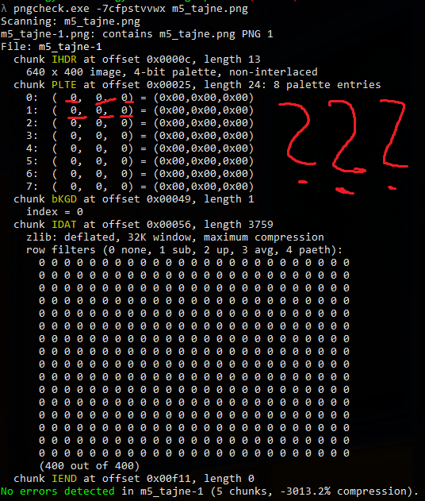

# Random stuff repo.

Note! some things might be missing or not so complete, I will fix it ASAP.
I am little back with eng solutions but I will fix it!

Random stuff, short scripts, ctf snippets.

Table of Contents:
   * [Random stuff repo.](#random-stuff-repo)
      * [Gyn](#gyn)
         * [PL](#pl)
                  * [PL: Mission 001](#pl-mission-001)
                  * [PL: Mission 002](#pl-mission-002)
                  * [PL: Mission 003](#pl-mission-003)
                  * [PL: Mission 004](#pl-mission-004)
                  * [PL: Mission 005](#pl-mission-005)
         * [EN](#en)
                  * [EN: Mission 001](#en-mission-001)
                  * [EN: Mission 002](#en-mission-002)
                  * [EN: Mission 003](#en-mission-003)
                  * [EN: Mission 004](#en-mission-004)
___
## Gyn

This directory contains solutions of GynvaelColdwind's missions from his streams in both english and polish language.

For tasks in polish I will make some comments. 

`<SPOILER_ALERT>` Solutions are hidden under links`</SPOILER_ALERT>`, so there will be no more spoiler alerts! You enter "solution" link at your own risk!

***
### PL
###### PL: Mission 001

Link to task:


[click](https://youtu.be/fBEe8DGZL5o?t=5416)


We've been given ciphertext, encrypted with XOR (which is not encryption... and by any means should not be used as one - to read: one time pad), there is also some information about key. It's 160 bits long. That's all. How to decrypt message?

`ciphertext:
1f9111
1799
0790001226d8
0a9e1e5c3ada
1f
099e195e
0a97075a21dac1
0a9710
199e075131d3
1199
12961350
`

My solution:
1. Given sample (or ciphertext) is not long. Creating histograms and trying frequency analisys is not the way to go here.
2. So how about xor operation itself. As we know `x ^ x = 0`. So if ciphertext is created in a way: `c = a^k` where c is a ciphertext, a is text message to be encrypted and k is a key, we can xor two strings from ciphertext encrypted with the same key. ` a^k^b^k = (a^b)^(k^k) and k^k = 0, so a^k^b^k = a^b`. And what are these a and b? Well, english words!
3. Let's grab long enough (6 chars long) words, xor them and check if they match xored sample strings. PWNED! 
4. The longest word has 7 characters, but there is only one such word, so I decided to use 6 chars long strings from sample. 
7. After finding 'collision', a pair of words described in `2.`, we've got pretty much all. Only one char is missing, but we can guess it from  the context. Well done!


[solver](gyn/challenge/pl/001/001.py)


And the soultion is:


[solution](gyn/challenge/pl/001/solution)


***
###### PL: Mission 002

Link to task:


[click](http://gynvael.vexillium.org/ext/cf55a15c2e7c157a8561e9c53b144a6fececc8a2.txt)


Comment: We're given a "matrix" of some weird strings. It looks like valid base64 strings, but after decoding it, agents got only "AAAAAAAAAAAAAAAAAAAAAAAA", this is a result of treating each fragment as separate string. The problem is that it's not valid password. We have to retrive another string from this data. Decoding whole set as single base64 string gives an error. 

My solution:

1. Base64 is ascii compatible, it encodes one of 64 printable character with a value in between (0, 63). Data is divided into chunks of 3 bytes. Number of data bytes should be divisible by 3 (padding if its not).
2. Values in range (0,63) can be presented by 6 bits. 
3. Every 'string' in that matrix starts with 'Q', I retrive 4 LB from every other letter after Q, put them in one byte and then convert it right back to the ASCII.


[solver](gyn/challenge/pl/002/002.py)

The password is:

[solution](gyn/challenge/pl/002/solution)


***
###### PL: Mission 003

Link to task:

[click](http://gynvael.vexillium.org/ext/8849db568879b4549b06c85056ca7e55f04c2229.txt)

Comment: You've been given program that prints you a flag. That's nice, isn't it? Yeah... just wait for the solution. I'm not sooooooo patient... Just read the code. 

My solution:

1. Change magic1 function to return just a + b (in the code I've made some comments if it's not clear for you so far) - nah, not so magic...
2. Change magic2 function to return just a x b - again no magic here.
3. Run your program and.... BINGO!


[solver](gyn/challenge/pl/003/003.py)


The password is:


[solution](gyn/challenge/pl/003/solution)

***
###### PL: Mission 004

Link to task:

[click](http://gynvael.vexillium.org/ext/501ec65ba47c1ffe6ab6fd3f3b150c91bf15c37f.txt)


Comment: Covert ops agent, has a serious problem with code lock. He managed to use some JTAG or another UARTs to dump firmware. Now we have to deobfuscate and crack it! 

```cpp
      #include <stdio.h>
      int check(char*b){char*p;for(p=b;*p;p++);if(((p-b)^42)!=47)return(
      ~0xffffffff);unsigned long long ch=0x1451723121264133ULL;for(p=b;*
      p;p++)ch=((ch<<9)|(ch>>55))^*p;return!!(14422328074577807877ULL==
      ch);}int main(void){char buf[1234];scanf("%1233s",buf);puts("nope"
      "\0good"+check(buf)*(6-1));return 0;}
```

Well that's the hell of the job to do! We better do it now!

Such snippet is not readable at all. I've decided to "deobfuscate" it using @KrzaQ's formatter available here: [formatter](http://format.krzaq.cc/)

Resoult of this operation:


```cpp
#include <stdio.h>
int check(char* b)
{
    char* p;
    for (p = b; *p; p++)
        ;
    if (((p - b) ^ 42) != 47)
        return (
            ~0xffffffff);
    unsigned long long ch = 0x1451723121264133ULL;
    for (p = b; *p; p++)
        ch = ((ch << 9) | (ch >> 55)) ^ *p;
    return !!(14422328074577807877ULL == ch);
}
int main(void)
{
    char buf[1234];
    scanf("%1233s", buf);
    puts("nope"
         "\0good"
        + check(buf) * (6 - 1));
    return 0;
}
```

Whoah, awesome! That looks nice! 

Let's analyze the code.

My solution:

1. In main function, that accepts no argv arguments, program alocates chars' buffer: `char buff[1234];`
2. Then it waits for input, reading up to 1233 chars + `\0` which is C style string terminator.
3. Later main function calls puts, printing one of two declarated strings "good" and "nope". Output depends on check(buff)*(6-1), this expression depends on what check function returns. So now it's time to analyze the core of this lock's firmware.
4. Function check accepts one pointer as an argument - it's pointer of char type, so it is the pointer to the `buff` buffer.
5. Then there is strange for newbies (like me) expr. `for(p = b; *p; p++);` it's a for loop, that starts in the begining of the buff string and stops... when? At the end of the buffer. So expression p-b is another way of saying `length(buff)`. Well I will stick to my version, but it's good to see another ways to present length of the string in C/C++ :)
6. Then we have if statement. `if(((p-b)^42)!=47)` If it's true our function returns ~0xffffffff number. We are familiar with `^` operator, it's used for xor operation. So if (p-b) xor 42 is not equal to 47. There is a very simple way, to "retrive" p-b, so the length of the string, value. I've used that in mission PL 001. `(p-b) = 47 ^ 42`. My python interpreter claims that:
```
>>> 42^47
5
```
If that condition is not met, function returns this strange value. Negation of all F <hex> values `~0xffffffff` means just return 0. Then pointer in `puts` func in main() points to "nope". So my awesome deduction skills tell me that password must be 5 chars long. That is bruteforceable! (I love bruteforce, it's very convinient way, and usually guarantees 100% correct solution. Sometimes it just matter of bilions of years...)
7. Then we've got declaration of variable ch. This variable is initialized with magic value `0x1451723121264133ULL` in decimal it is `1464076909207241011`.
8. Next instruction is another for loop.
```cpp
    for (p = b; *p; p++)
        ch = ((ch << 9) | (ch >> 55)) ^ *p;
```
What it does, for each char of password, it shifts current value of ch (bitwise) nine bits left, ORs it with current ch shifted 55 bits right (its called bit roll) and XORs it with current char. This is assigned to ch, so in next iteration we've got another value. 
Finally function `check` returns value of comparision of magic value and ch. So at the end our ch value must be equal `14422328074577807877ULL`, ULL stands for `unsigned long long` if someone is curious. 
9. So if it's bitwise roll, nothing is lost, so I can just roll back to the original value and xor it with the score, that gives us the original value of *p, so the value of particular char - letter of the password! HACK YEAH. 


So finally, lets wrap it up and code:
Dumbest solution ever, but if you have enough time, go on, brute it!:

[dummy](gyn/challenge/pl/004/dumb.py)

TODO: Write multicore cracker.
And my cute, not so dumb solver:

[solver](gyn/challenge/pl/004/004.py)


Dear agent, your password is:


[solution](gyn/challenge/pl/004/solution)


    Over and out

My micro shoutout is dedicated to @disconnect3d, I've encountered his solution after doing my... and I feel dumb :P thats awesome, here is a link to his writeup (eng) : [click](https://disconnect3d.pl/2017/05/29/Gynvael-Coldwind-mission-04-angr-solution)


***
###### PL: Mission 005


Link to task:

[task](https://youtu.be/PQR5zSS6_Rk?t=7123)

[target](http://gynvael.vexillium.org/ext/m5_tajne.png)


Comment: This mission has been leaked during EP42 on OSDev PL Livestream, so we could start cracking it earlier. Let's go! 
For nonpolish speakers: special agent (probably that encoding genius), finally managed to do something. He made a photo of password to server. Unfortunately, as usual, something went wrong, and we are asked to fix that mess. The picture (available under `target` link) is blank/black. Mission is rated 2/10. 


My steps to solution:

1. There are no notes on the server, on which we can find the picture. As usual, it's time for some forensic job. I've started with `file` program, on Windows. The output:
    `m5_tajne.png: PNG image data, 640 x 400, 4-bit colormap, non-interlaced`
2. Ok, so this time we have "valid" (as far as header and other standard's constraints are concerned) PNG file, with resolution `640x400` and 4 bit colormap. But I still felt uninformed. The challenge is rated 2/10, so it cannot be so difficult. Unfortunately playing with contrats, colors and alpha level in gimp wasn't the way to go. 
3. Before any further job, grab that link: [click](https://tools.ietf.org/html/rfc2083) it might be useful!
4. Armoured with RFC, I wasn't so sure about the way this challenge should be solved. So after short google query, I've found some realy useful PNG tool, called `pngcheck`. The output of all possible flags is presented in the image below.

6. Well, that's interesting! I'm not fluent in formats, but PLTE which refers to some palette entries as described in `pngcheck` is probably somehting connected to colors. And AFAIK RGB = (0,0,0) is black color, so if all palette entries are set to zero, maybe this is the case... Let's define own colors palletes and insert them into a file. But how to change these values? We could probably do it in HexEditor, like gvim with xxd, but I've chosen python (hah!) and binary libraries like struct. This time my armour is Python2, because of bytes, bytestrings, encoding etc... Short&fast reaserch leads to that post on StackOverflow: [link](https://stackoverflow.com/a/1214765/6849518). There is also posibility to use PILLOW lib. 
7. On page 17 of given RFC, there is full information we need to understand how PLTE works. [link](https://tools.ietf.org/html/rfc2083#page-17). PLTE sections contains `chunks` of 3-byte series (RGB) with values in range (0,255). Where three zeros mean... BLACK, so our assumptions from point previous point are correct... So I've randomly generated colors for all palettes' entries and concatenaded them into one binary string. 
```python
 paldata = '\x0f\x0f\x0f' + '\xf0\xf0\xf0' + '\x00\xff\xde' + '\xff\x00\xde' + '\xde\xff\x00' + '\x00\x00\x00' + '\xff\xff\xff' + '\xde\xde\xde' 
 ```
 Then, there is only one thing needed. To protect data integrity PNG uses CRC checksum algorithm. It's described [here](https://tools.ietf.org/html/rfc2083#page-15)
 Fortunately zlib gives us all tools needed to calculate crc32. Writing it is simple:
 ```python
                 f.write(struct.pack('>L', crc32(chtype+paldata)&0xffffffff))
```
`&` operation slices length of calcaled number to 32 bits, that are required by standard. 
8. BINGO! There is our password dear agent! Steganography is an art! 


Python solver:

[solver](gyn/challenge/pl/005/005.py)

Password:

[solution](gyn/challenge/pl/005/solution)

Deobfuscated image after using solver:

[solution_image](gyn/challenge/pl/005/m5_nietajne.png)

***
###### PL: MISSION 006

[task](http://gynvael.vexillium.org/ext/250fb09e4757f43a8aaaa4b01d293c68d5109cb5_misja006.txt)

TL;DR; in english:

We are given another encoded piece of information. Source says that it's from 60's and text is in polish. 

```c5 c2 c3 c4 c9 c3 40 82 a8 93 82 a8 40 86 81 91 95 a8 40 87 84
  a8 82 a8 40 82 a8 93 40 93 96 87 89 83 a9 95 a8 4b 40 c1 93 85
  40 95 89 85 40 91 85 a2 a3 4b
```

My solution:
1. As we see, there are some higher bits enabled. My first approach was to search for some really old encodings used in Odras computers in Poland in 1960's but all my guesses were false.
2. After searching "encoding guessing" I've found really convinient python library called cchardet or chardet. I've tried both. If you know any proper way to get this encoding right with this libs, please give me a hint. The closest I got was:
```{'encoding': 'ISO-8859-7', 'confidence': 0.9900000095367432}```
But it's not the correct solution, because decoding this message gives only another hex string.
3. As I remember, python has really good support of string decoding, so I've decided to bruteforce and use all possible encodings in this language. 
4. Boom! Correct string. In solution there are two lines. First is "the original one", second is translation for non-polish speakers.

Python solver:

[solver](gyn/challenge/pl/006/006.py)

Password:

[solution](gyn/challenge/pl/006/solution)

***
###### PL: MISSION 007


Link to task:

[click](http://gynvael.vexillium.org/ext/a77eb7ca6d30d8e1cfb3572b0dbc2d364ad9c7fb_misja007.txt)

Comment:

Another encrypted message! I think that mr. "I should never become an agent" strikes again! 
Task is rated 1/10, so check your seatbelts, because we gonna do this quick! (never, ever understiminate your enemy! Even if rated 1/10)
Text tells us, that encryption was performed with ROTn algorithm but with "changing key". 

My solution:
1. Think twice, write once. There is no need to write tons of code. Be reasonable. My first guess was to try decoding with increasing/decreasing `n` value. 
2. Done! Thanks!

Python solver:

[solver](gyn/challenge/pl/007/007.py)

Solution:

[solution](gyn/challenge/pl/007/007.py)***
***
### EN
###### EN: Mission 001

Task was simple, you've been given target hash:

`76fb930fd0dbc6cba6cf5bd85005a92a`

It was produced by xoring two md5 hashes of two english words.

My solution (python):

1. Get eng words list
2. Create dict hash:word
3. Make cartesian product of keys of dict
4. xor each pair of hashes 
5. Compare it with original hash, if it matches... BINGO! 


[solver](gyn/challenge/en/001/001.py)


And these words are:


[solution](gyn/challenge/en/001/solution)


***
###### EN: Mission 002

Link to task:


[click](http://goo.gl/iPQE89)


We have to decode message using Huffman's algorithm using given tree. The main difficulty in this task it is to present given tree in some data structure. There is a lot o ways doing it, I've decided to make dictionary. It's simple and fast. 

My solution:

1. Create dictionary based on tree given
2. Substitute all xs and ys with 1 and 0 or 0 and 1 (we don't know if 1 means go right or go left)
3. Go char by char and search for fitting pattern. 
4. Decode hex string to ascii string.


Works on python3


[solver](gyn/challenge/en/002/002.py)


The solution is:


[solution](gyn/challenge/en/002/solution)

***
###### EN: Mission 003

Link to task:


[click](http://gynvael.vexillium.org/ext/a4ff898c9e5109d832421f795d2b9d9898a04d16.txt)


I love that formatting! Anyway, let's focus on our job. 


The task is to decode given data encoded with Huffman's algorithm. Same as mission 002. But this time, somebody forgot decoding tree!!! Honestly, this task took me more than previous one, but had a lot of fun cracking it!


data = 
`10101011101000110100011101111111011111110111010010110010011100101111001011001001
10111001101000111011111110100101111010011101111011001011001001110101011110110011
11101011111011110111101111011101111111001011001001011001001110110011100101100100
11010001110110011110110100101100100110111001110010111
`

My solution:

1. The most important part of task content is: 'He said that he took the plaintext message, interpreted the bytes that
made the message as a large little-endian encoded number, then encoded that as
a quaternary number (i.e. number in the base/radix 4 system), and then compressed
it with Huffman encoding.'
2. So if he encoded it as quaternary number there are only four characters used to encode whole message {0,1,2,3}. That makes our task of bruteforcing Huffman's tree so much faster...
3. Then we have change this great quaternary number to ASCII and read it from MSB. That's it! 


My solver looks like:


[solver](gyn/challenge/en/003/003.py)


The solution is:


[solution](gyn/challenge/en/003/solution)


***
###### EN: Mission 004

Link to task:


[click](http://gynvael.vexillium.org/ext/19e9b863bbab65e7178a1113a25d59f479ce5939.txt)


My solution:

1. Definitely something was hacked up. Given data cannot be converted to chars from HEX values. Python decode rises exception:
`UnicodeDecodeError: 'utf8' codec can't decode bytes in position 0-1: invalid continuation byte`. Good job agent! Now you're talking to yourself only... 
2. My first idea, before reading anything was to find some decent UTF-8 decoder, this site seems to be useful:
[click](https://software.hixie.ch/utilities/cgi/unicode-decoder/utf8-decoder), if you paste our text and select input type "hexadecimal", you will be home. But I won't be myself without trying own implementation. So lets assume, we have to "crack it"!
3. Firstly, I've tried to use my intuition. Some time ago, I've read about UTF-8 encoding itself. There is a possibility to present the same character using different codes. This was (or still is, but only in poorly developed code), a security bug, that allows for example to use another code for `/` character. Why it is so dangerous? Well, if for example webapp doesn't escape all possible version of slash, something called `path traversal` can occour and the attacer can "jump out of www directory" and read other files, for example some *.conf ones. I highly encourage you to read this link: [click](https://www.owasp.org/index.php/PathTraversal)


My solver:


[solver](gyn/challenge/en/004/004.py)


And the password is:


[solution](gyn/challenge/en/004/solution)

***
###### EN: Mission 005

Link to task:

[click](http://gynvael.vexillium.org/ext/thepicture/)


My solution:

1. Given address redirect us to some page. In all my web browsers, there is only this icon available:  This usually means broken image, or unavailable resource. 
2. Viewing the source of that webpage gives us interesting message left by agent:
    
    <!-- Note: some browsers like Chrome, Firefox, IE, Safair, Edge, etc
         might not support this type of HTTP compression and image format.
         Actually, I don't think any browser supports it.
         It's perfect security!
    -->
3. 

[](https://spacevim.org)
