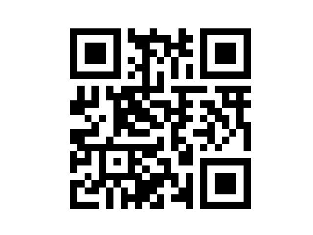
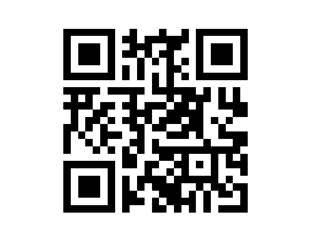
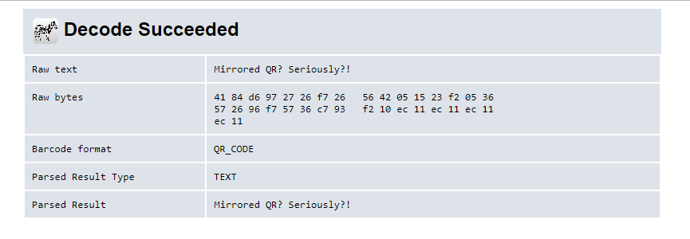

EN Mission 006

Link to task:

[click](http://gynvael.vexillium.org/ext/4118eb92fe0799f5b5e73c1e1efee294df2ec872_mission006.txt)

With data file:

[click](http://goo.gl/S395x6)

My comment:
We were given set of data. This kind of tuples could be vectors or points. I assumed that they are points, because task is rated "only 7/10" (visualisation of for example movement by vectors will be a little harder but also doable)

My solution:
1. Firstly I've searched for the greatest value in the data set. It appered to be 24. So I've created matrix 24x24 using numpy.
2. For each point from the set, I've changed values in array from zero to 255 (max value). Points not included in data, were marked as zero.
3. Then using
```python
import matplotlib.pyplot as plt
plt.imshow(...)
```
  I've created an image. It looks pretty familiar.



4. Reading this QR code with `https://zxing.org/w/decode.jspx` (and few others readers) gave me an error. So I searched for qrcodes in Google Graphics, and... well "normally" QR codes have this sqares in the corners on the other side. So I decided to make mirror of this qr code:



  And after putting it into online decoder:



That's it!

This is our password! Thanx!

I've checked first version of this qrcode and it apparently works... So I do not know, why it failed previously. But we've got flag!
