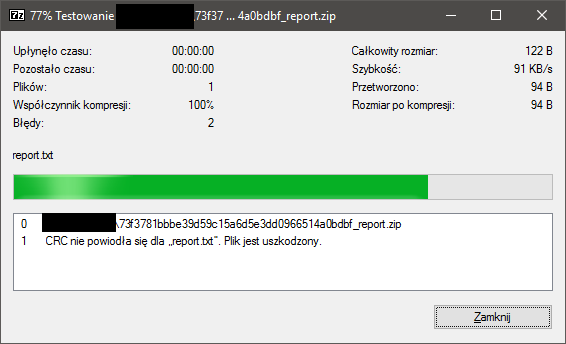
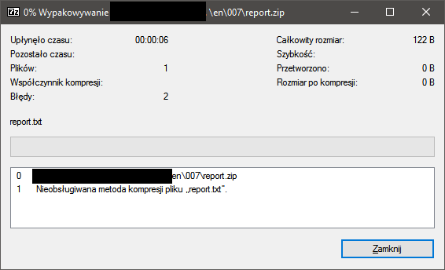
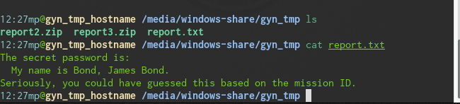

EN: Mission 007

Link to task:

[click](http://gynvael.vexillium.org/ext/659530fc374da060c014f6d4dd5c124040dfb458_mission007.txt)

Comment:

Another mission of really skilled agents. Another hackup! We are given zip file, with single file report.txt. And we have to get access to that file. But our agent changed some values (he zeroed something in ZIP headers).

1. First things first, I've tired to open file but unfortunately:

  The value of crc checksum is not valid, so 7zip cannot unzip the file. It's time to arm yourself in decent hexeditor and some knowledge [1] and [2].
  For non-polish speakers message says:
  `CRC filed in "repor.txt". File is corrupted.` And that is absolutely correct infromation, because changing some values in file gives another CRC checksum.

2. Investigation time! I've opened that file in Hexeditor, and what cought my attention were zeroed `CompresionType` fields. So I've decided to change that to the first option aviable. unfortunately that didn't worked. So I kept changing those values and... nothing... An error says: `Not implemented type of compression`. Python zipfile filed on Windows too.

  But then, I decided to change my host OS, and I've used `7za e report.zip` and it worked!

So that's it!

[Solution - report.txt](report.txt)

And fixed zip:

[fixed_file](report.zip)

Usefull links:

[1] [Wikipedia](https://en.wikipedia.org/wiki/Zip_(file_format))

[2] [Corkami](https://github.com/corkami/pics/blob/master/binary/zip101/zip101.pdf) - Really good source, if you are new to RE, fileformats CHECK OUT Ange Albertini posters and presentations.
