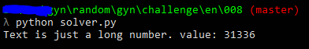

# MISSION EN: 008

Link to the task:

[click](http://gynvael.vexillium.org/ext/5706ef638fb18886808453f47db0f5269a203250_mission008.txt)

I should probably add missions plaintext to writeups:

```
Welcome back agent 1336.
No mail.
> mission --take
MISSION 008               goo.gl/urZsGS             DIFFICULTY: ██░░░░░░░░ [2╱10]
┅┅┅┅┅┅┅┅┅┅┅┅┅┅┅┅┅┅┅┅┅┅┅┅┅┅┅┅┅┅┅┅┅┅┅┅┅┅┅┅┅┅┅┅┅┅┅┅┅┅┅┅┅┅┅┅┅┅┅┅┅┅┅┅┅┅┅┅┅┅┅┅┅┅┅┅┅┅┅┅┅

Oh great. We received another message. "It's plaintext" - that's what he told us.
We knew better, but we still had hope that it will actually be plaintext. It
wasn't. It was just this huge number:

    1087943696176439095600323762148055792209594928798662843208446383247024

We called the agent and asked about it. Calmly. We didn't yell. Not at all. Maybe
A little.

He told us it was plaintext. He just multiplied it by an unknown number. We will
just give it to you to decipher.

On a more positive note, we have two new agents in training.

GOOD LUCK!

If you decode the answer, put it in the comments under this video! If you write
a blogpost / post your solution online, please add a link in the comments too!

P.S. I'll show/explain the solution on the stream next week.
P.S.2. It's just two bytes. But there is a plot twist. Expect the unexpected.
```

### My comment:

So this time we are given whole message in one single number. This single number was then multipiled by some unknown value and then sent to us. So to decrypt that we have to find possible `divider` and then try to convert this huge number to text.


### Solution:

1. Python is a very handy tool when it comes to CTF task, maths, networking and stuff like that. So it's obvious that I will use it here. First minor task to do, when it comes to this challenge is to determine which value was used by agent. Simple for loop:
```python
for i in range(0, 0xffff):
      try:
          k = msg // i
          n = k.to_bytes((k.bit_length()), 'big')
          print("{} value: {}".format(n.replace(b'\x00', b'').decode('utf=8'), i))
      except:
          pass
```

2. Then, in that for loop there is dirty&quick solution of printing only all printable characters (try, catch block because Python is EAFP language [1]). How it's done? Well, at first we have to understand how "packed" strings are created. This is the method of storing data, which don't waste memory. A very good explanation is given here [2].Fortuntately there are ways to convert that number to string or bytes. And that gives us an  opportunity to print whole message!




```
λ python solver.py
Text is just a long number.
```

And the value that was ussed by agent to "encrypt" data is: `31336`


[1] [Glossary](https://docs.python.org/3/glossary.html#term-eafp) `It's easier to ask forgiveness than it is to get permission.`

[2] [click](https://forums.alliedmods.net/archive/index.php/t-90735.html)
